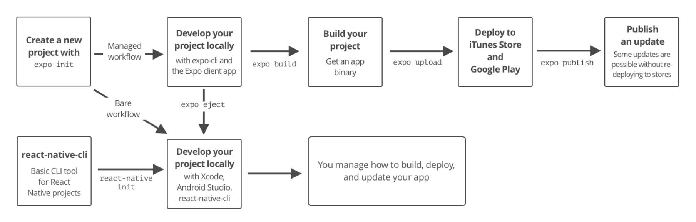

# Social_distancing_detector
Alarm system to detect whether people are less than 2m away from each other. If so, turns on the alarm as a warning.

This project uses [yarn] (https://yarnpkg.com/lang/en/) as the package manager.

Frame work: react-native.

Version: 0.61.4.

Supports both Android and iOS devices.


## Install dependencies

```command
yarn install
```

## Run development server - start project

```command
yarn start
```

or

```command
expo start
```

## Managed and Bare Workflows



Starting with a managed workflow to keep development simple. However, may need to eject Expo (going from managed to bare workflow) in order to use the Bluetooth interface on different devices, as it requires us to manually configure native modules, which would have been managed by Expo cli.

## Docs

- Expo -- a set of tools and services for building, deploying, and quickly iterating on native iOS, Android, and web apps from the same codebase. 

  https://docs.expo.io/versions/v34.0.0

- React Native
  https://reactnative.dev/docs/getting-started

- Step-by-step guid to configure your environment to allow Blue tooth development with Expo and React Native
https://blog.expo.io/so-you-want-to-build-a-bluetooth-app-with-react-native-and-expo-6ea6a31a151d

- (possible solution) react-native-Geolocation API for location tracking of devices.
Reference:

  https://reactnative.dev/docs/geolocation  (Deprecated).

  https://github.com/react-native-community/react-native-geolocation  (maintained).

- (possible solution) react-native-ble-manager API to control Blue tooth on devices.
  https://github.com/innoveit/react-native-ble-manager

